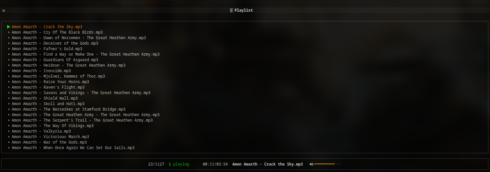

# CPlayer




**C**ommand Line **P**ython p**layer** is a minimalist song player written with Python
([github](https://github.com/eccanto/cplayer)), this application offers a wide range of functionality to
enhance your music listening, playlist management, filtering and searching songs and more using keyboard shortcuts.

Below, you'll find a comprehensive list of keyboard shortcuts and their corresponding actions within the application,
and additional configurations: [keyboard shortcuts and customized configurations](cplayer/documentation/help.md).

Only tested in Linux.

## Table of contents

* [Features](#features)
* [Get started](#get-started)
  * [Installation](#installation)
  * [Uninstallation](#uninstallation)
  * [Usage](#usage)
  * [Options](#options)
* [TODO](#todo)
* [Known issues](#known-issues)
* [Developers](#developers)
  * [Set up the Git hooks custom directory](#set-up-the-git-hooks-custom-directory)
  * [Basic configuration](#basic-configuration)
  * [Testing](#testing)
  * [Advanced configuration](#advanced-configuration)
  * [Static code analysis tools](#static-code-analysis-tools)
    * [Python static checkers](#python-static-checkers)
    * [Run manually](#run-manually)
* [License](#license)
* [Changelog](#changelog)

## Features

* GUI customization.
    * If your system does not support the icons used you can set them manually in [~/.config/cplayer/config.yaml](cplayer/resources/config/default.yaml).
* Keyboard shortcuts customization.
* Create multiple playlists and manage then.
* Multiple ways to navigate through the playlist including jumping by position, filtering, manual displacements,
  sorting, etc.

## Get started

### Installation

This application can be simply installed by running:

```bash
pip install cplayer
```

if you want to install from a source distribution:

```bash
git clone https://github.com/eccanto/cplayer
cd cplayer/
pip install .
```

### Uninstallation

To uninstall the application you can use `pip`:

```bash
pip uninstall cplayer
```

### Usage

To run the application you must run the command line:

```bash
cplayer
```

By default the application will use the current path to load `.mp3` files in the directory (not recursively)

### Options

```bash
$ cplayer --help

Usage: cplayer [OPTIONS]

  Command line music player.

Options:
  -p, --path PATH  Songs directory path.
  --help           Show this message and exit.
```

### TODO

* Download songs from a Youtube URL.
* Add option to restore default configurations.
* Add confirmation dialog to remove/add songs.
* Add "recent" sections: recent folders, recent playlists, recent songs.

### Known issues

* `tmux` subpanels may cause the application dimensions to be incorrect.

### Developers

This project use [tox](https://tox.wiki/en/latest/) and [pytest](https://docs.pytest.org/) to run the library tests.

#### Set up the Git hooks custom directory

After cloning the repository run the following command in the repository root, this ensures that library tests are run
before each push into the repository to maintain the quality of the project:

```bash
git config core.hooksPath .githooks
```

#### Basic configuration

Install development python requirements

```bash
pip install -r requirements_dev.txt
```

#### Testing

Simply run "`tox`" to execute all the library tests.

```bash
tox
```

to run the tests for a particular Python version, you can do:


```bash
tox -e py38
```

to clean the test environment:

```bash
tox -e clean
```

#### Advanced configuration

By default `tox` will look for the python versions available on the system, and will run the compatibility tests on
the detected ones, and skip the versions not found. To ensure that compatibility tests are run for all Python
versions, the following steps must be followed:

1. Install [pyenv](https://github.com/pyenv/pyenv)
2. Install python versions:

    ```bash
    for python_version in "3.7" "3.8" "3.9" "3.10" "3.11" ; do pyenv install ${python_version}; done
    ```

3. Enable python versions:

    ```bash
    pyenv local "3.7" "3.8" "3.9" "3.10" "3.11"
    ```

4. Reinstall virtualenv (`if necessary`)

    ```bash
    # uninstall virtualenv
    pip uninstall virtualenv
    sudo apt purge python3-virtualenv

    # install virtualenv
    pip install virtualenv
    ```

5. Install development python requirements (`if necessary`)

    ```bash
    pip install -r requirements_dev.txt
    ```

#### Static code analysis tools

These are the static analysis tools that will help us to follow good practices and style guides of our source code. We
will be using the following tools, which will be executed when generating a new push in the repository (git hooks).

##### Python static checkers

Tools used:

* [brunette](https://github.com/odwyersoftware/brunette): A best practice Python code formatter.
* [isort](https://pycqa.github.io/isort/): Python utility / library to sort imports alphabetically, and automatically
  separated into sections and by type.
* [prospector](https://github.com/PyCQA/prospector): Prospector is a tool to analyze Python code and output information
  about errors, potential problems, convention violations and complexity.

  Tools executed by Prospector:
  * [pylint](https://github.com/PyCQA/pylint): Pylint is a Python static code analysis tool which looks for programming
    errors, helps enforcing a coding standard, sniffs for code smells and offers simple refactoring suggestions.
  * [bandit](https://github.com/PyCQA/bandit): Bandit is a tool designed to find common security issues.
  * [dodgy](https://github.com/landscapeio/dodgy): It is a series of simple regular expressions designed to detect
    things such as accidental SCM diff checkins, or passwords or secret keys hard coded into files.
  * [mccabe](https://github.com/PyCQA/mccabe): Complexity checker.
  * [mypy](https://github.com/python/mypy): Mypy is an optional static type checker for Python.
  * [pydocstyle](https://github.com/PyCQA/pydocstyle): pydocstyle is a static analysis tool for checking compliance
    with Python [PEP 257](https://peps.python.org/pep-0257/).
  * [pycodestyle](https://pycodestyle.pycqa.org/en/latest/): pycodestyle is a tool to check your Python code against
    some of the style conventions in [PEP 8](https://peps.python.org/pep-0008/).
  * [pyflakes](https://github.com/PyCQA/pyflakes): Pyflakes analyzes programs and detects various errors.
  * [pyroma](https://github.com/regebro/pyroma): Pyroma is a product aimed at giving a rating of how well a Python
    project complies with the best practices of the Python packaging ecosystem, primarily PyPI, pip, Distribute etc,
    as well as a list of issues that could be improved.
* [twine](https://twine.readthedocs.io/en/stable/): The `twine check` command is used to perform various checks on a
  Python package distribution before uploading it to the **Python Package Index** (PyPI) using twine.

##### Run manually

```bash
tox -e check_code
```

## License

[MIT](./LICENSE)

## Changelog

* 1.0.0 - Initial version.
